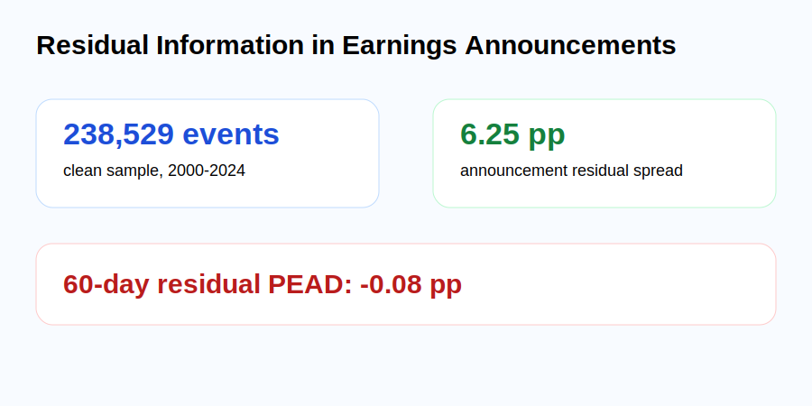
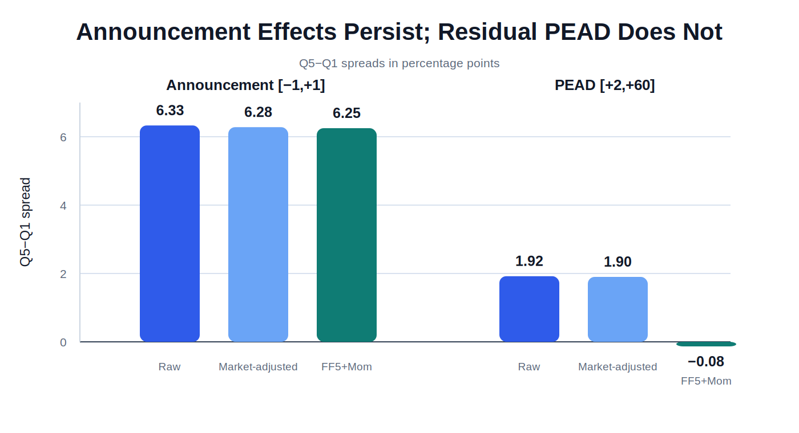
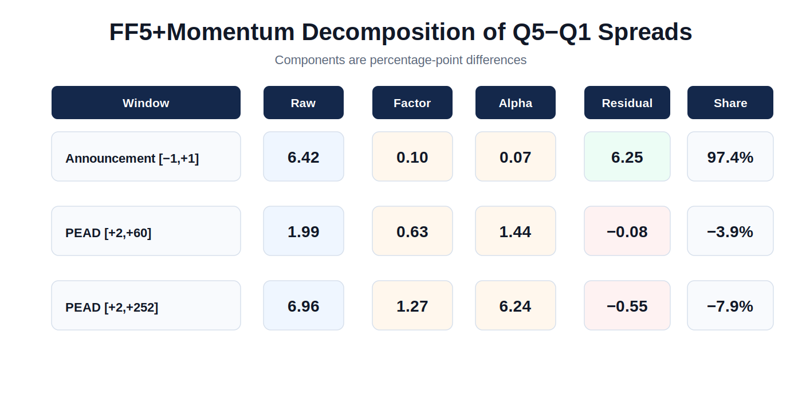
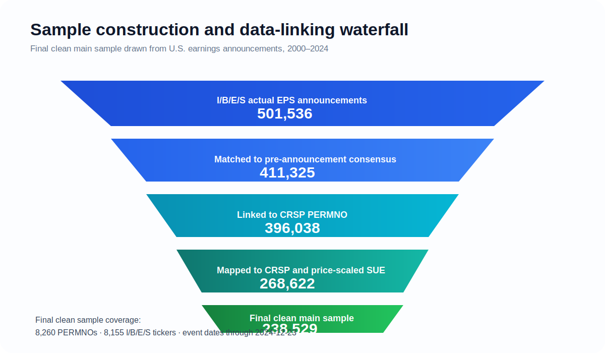

# Residual Information in Earnings Announcements

A public, GitHub-safe companion to an empirical asset-pricing project on earnings surprises, announcement-window returns, and post-earnings-announcement drift (PEAD).

> **Main result.** Large announcement-window earnings-surprise spreads remain almost entirely intact after factor adjustment, whereas longer-horizon drift is largely absorbed by expected-return components.

## At a glance

- **Sample:** 238,529 clean earnings-announcement events from **2000–2024**.
- **Data backbone:** I/B/E/S actuals and forecasts linked to CRSP, Compustat, and Fama–French factors.
- **Core design:** Annual analyst-SUE sorts, event-window returns, and event-level decompositions under multiple expected-return benchmarks.
- **Main empirical message:** The market reacts strongly and residually at the earnings announcement, but much of the apparent drift over the following months is not residual abnormal return.

## Visual abstract

<table>
<tr>
<td width="50%"></td>
<td width="50%"></td>
</tr>
<tr>
<td width="50%"></td>
<td width="50%"></td>
</tr>
</table>

## Key results

### 1) Sample construction

| Stage | Events | PERMNOs | I/B/E/S tickers |
|---|---:|---:|---:|
| I/B/E/S actual EPS announcements | 501,536 | — | 16,444 |
| Matched to pre-announcement consensus | 411,325 | — | 13,408 |
| Linked to CRSP PERMNO | 396,038 | 12,676 | 12,477 |
| Mapped to CRSP and price-scaled SUE | 268,622 | 9,331 | 9,209 |
| **Final clean main sample** | **238,529** | **8,260** | **8,155** |

### 2) Announcement-window spreads survive factor adjustment

| Window | Benchmark | Q5−Q1 spread (pp) | p-value |
|---|---|---:|---:|
| Announcement [−1,+1] | Raw CAR | 6.33 | <0.001 |
| Announcement [−1,+1] | Market-adjusted CAR | 6.28 | <0.001 |
| Announcement [−1,+1] | FF5+Momentum AR | 6.25 | <0.001 |

### 3) Post-announcement drift does not survive as residual abnormal return

| Window | Benchmark | Q5−Q1 spread (pp) | p-value |
|---|---|---:|---:|
| PEAD [+2,+60] | Raw CAR | 1.92 | <0.001 |
| PEAD [+2,+60] | Market-adjusted CAR | 1.90 | <0.001 |
| PEAD [+2,+60] | FF5+Momentum AR | −0.08 | 0.669 |
| PEAD [+2,+252] | Raw CAR | 6.60 | <0.001 |
| PEAD [+2,+252] | FF5+Momentum AR | −0.55 | 0.389 |

### 4) FF5+Momentum decomposition

| Window | Raw spread | Factor exposure | Alpha/intercept | Residual AR | Residual share |
|---|---:|---:|---:|---:|---:|
| Announcement [−1,+1] | 6.42 | 0.10 | 0.07 | 6.25 | 97.4% |
| PEAD [+2,+60] | 1.99 | 0.63 | 1.44 | −0.08 | −3.9% |
| PEAD [+2,+252] | 6.96 | 1.27 | 6.24 | −0.55 | −7.9% |

## What this repository contains

This public version is designed to be safe, professional, and easy to inspect on GitHub.

- **Polished manuscript figures** in SVG format for crisp browser rendering.
- **Reader-facing summaries** of the research design and main findings.
- **Quant-relevant framing** around event studies, expected-return modeling, abnormal-return decomposition, and empirical asset pricing.
- **No proprietary WRDS raw data** and no journal-submission-only files.

## Figure gallery

Selected GitHub-safe visual assets are available in `docs/figures/`:

1. `visual_abstract.svg`
2. `announcement_vs_pead.svg`
3. `decomposition.svg`
4. `sample_funnel.svg`

## Research design in one paragraph

For each earnings announcement, the project computes a price-scaled analyst surprise using the latest eligible pre-announcement consensus forecast and the stock price two trading days before the event. Firms are sorted into annual quintiles, event-window returns are computed over the announcement window and post-announcement horizons, and the return spread between the highest- and lowest-surprise quintiles is evaluated under raw returns, market-adjusted returns, and factor-model abnormal returns. The project then decomposes raw spreads into factor-exposure, alpha/intercept, and residual abnormal-return components.

## Notes for public use

This repository is a **public companion** rather than a full replication package. The codebase architecture remains useful for discussing WRDS integration, event-study implementation, factor modeling, portfolio construction, and research communication. Proprietary source data are omitted for licensing reasons.

## Companion documents

- `docs/github_safe_summary.md` — extended summary for readers and recruiters.
- `docs/managerial_finance_abstract.md` — journal-formatted abstract.

## References

- Ball, R. and Brown, P. (1968). An empirical evaluation of accounting income numbers. *Journal of Accounting Research*, 6(2), 159–178.
- Bernard, V.L. and Thomas, J.K. (1989). Post-earnings-announcement drift. *Journal of Accounting Research*, 27, 1–36.
- Brown, S.J. and Warner, J.B. (1985). Using daily stock returns: The case of event studies. *Journal of Financial Economics*, 14(1), 3–31.
- Carhart, M. (1997). On persistence in mutual fund performance. *Journal of Finance*, 52(1), 57–82.
- Fama, E.F. and French, K.R. (1993). Common risk factors in the returns on stocks and bonds. *Journal of Financial Economics*, 33(1), 3–56.
- Foster, G., Olsen, C. and Shevlin, T. (1984). Earnings releases, anomalies, and the behavior of security returns. *The Accounting Review*, 59(4), 574–603.
- Hong, H., Lim, T. and Stein, J.C. (2000). Bad news travels slowly: Size, analyst coverage, and the profitability of momentum strategies. *Journal of Finance*, 55(1), 265–295.
